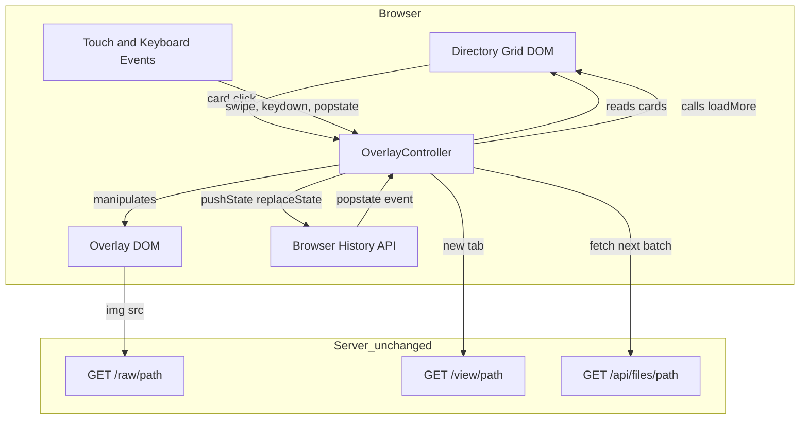
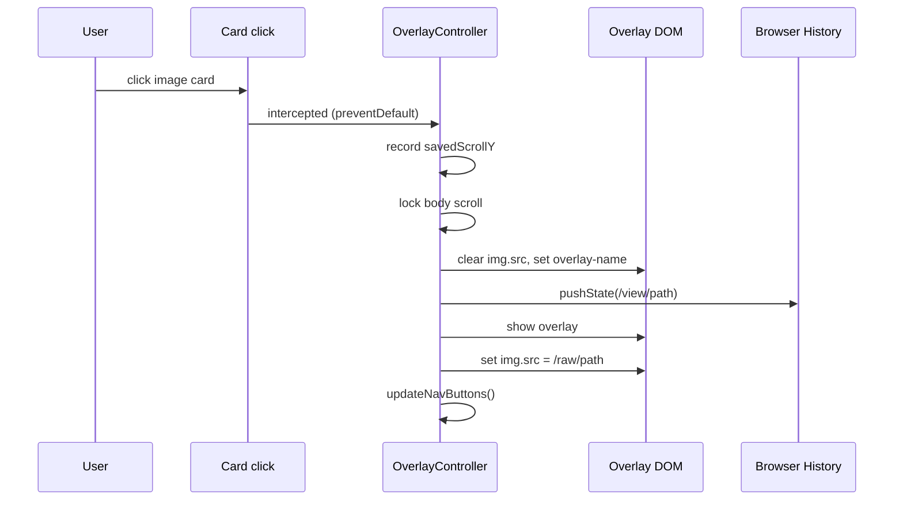
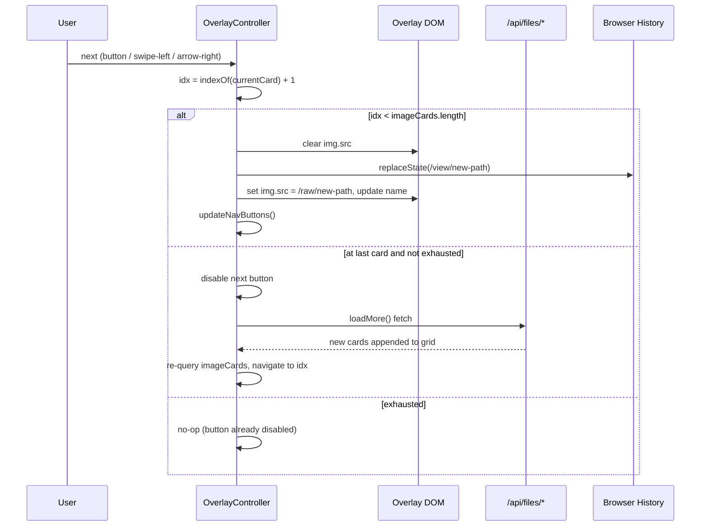
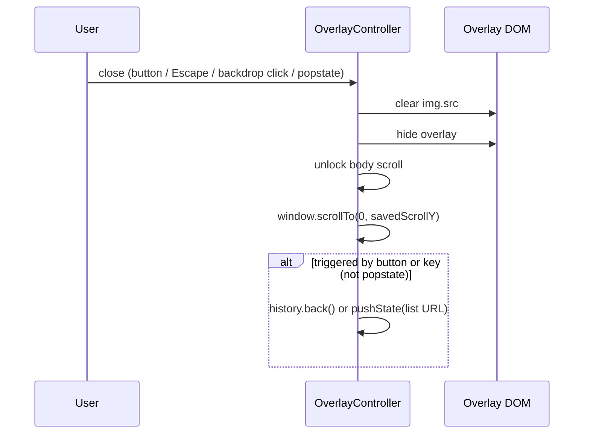

# Design Document: modal-display

## Overview

This feature changes how image files are opened from the directory listing. Instead of navigating to a separate `/view/*` page, clicking an image card opens a full-screen overlay on the same page. Video files open in a new browser tab via the existing SSR viewer. PDF files continue to navigate to the SSR viewer page.

**Purpose**: Delivers scroll-position preservation, sort-aware navigation, and swipe-based browsing to users accessing the viewer from older smartphones over Wi-Fi.

**Users**: Home-network users browsing NAS media from mobile and desktop browsers.

**Impact**: Replaces page-level navigation for image files with in-page overlay. The server is entirely unchanged; all modifications are to `public/app.js`, `public/style.css`, and `src/views/directory.ecr`.

### Goals
- Open image files in an in-page overlay without losing scroll position or sort state
- Provide prev/next navigation that respects the current sort order
- Support swipe gestures (≥50 px horizontal) on touch devices
- Keep URL in sync with displayed file via the History API
- Stay within the JS ≤ 4 KB and CSS ≤ 3 KB size budget

### Non-Goals
- Video playback in the overlay (video opens in a new tab)
- PDF preview in the overlay (PDF navigates to existing SSR viewer)
- Server-side changes of any kind
- Progressive Web App features or offline support

---

## Requirements Traceability

| Requirement | Summary | Component | Interface / Element |
|---|---|---|---|
| 1.1 | Image click opens overlay | OverlayController (click handler) | `openOverlay(card)` |
| 1.2 | Image shown via `` | OverlayController | `#overlay-img` |
| 1.3 | Video opens new tab | OverlayController (click handler) | `window.open(href, '_blank')` |
| 1.4 | Filename shown in overlay | OverlayController | `#overlay-name` |
| 1.5 | Close button visible | Overlay HTML + CSS | `#overlay-close` |
| 1.6 | Close button dismisses overlay | OverlayController | `closeOverlay()` |
| 1.7 | Background scroll locked | OverlayController | `document.body.style.overflow` |
| 2.1 | Prev/next respects sort order | OverlayController | `getImageCards()` (live DOM query) |
| 2.2 | Prev navigates backward | OverlayController | `showFile(idx - 1)` |
| 2.3 | Next navigates forward | OverlayController | `showFile(idx + 1)` |
| 2.4 | Nav updates content in-place | OverlayController | `showFile()` |
| 2.5 | Prev disabled at first item | OverlayController | `updateNavButtons()` |
| 2.6 | Next disabled at last+exhausted | OverlayController | `updateNavButtons()` |
| 2.7 | Fetch next batch at end | OverlayController → `loadMore()` | `loadMore()` (shared scope) |
| 3.1 | Scroll position recorded | OverlayController | `savedScrollY` |
| 3.2 | Scroll position restored on close | OverlayController | `window.scrollTo(0, savedScrollY)` |
| 3.3 | Grid DOM kept intact | OverlayController (no DOM removal) | — |
| 4.1 | Swipe ≥50 px detected | OverlayController (touch handler) | `touchstart` / `touchend` |
| 4.2 | Left swipe → next | OverlayController | `showFile(idx + 1)` |
| 4.3 | Right swipe → prev | OverlayController | `showFile(idx - 1)` |
| 4.4 | No vertical scroll interference | Touch handler (checks Y delta) | — |
| 4.5 | No action when unavailable | `showFile()` guard + `updateNavButtons()` | — |
| 5.1 | `pushState` on open | OverlayController | `history.pushState` |
| 5.2 | `replaceState` on nav | OverlayController | `history.replaceState` |
| 5.3 | Back button closes overlay | OverlayController | `window` `popstate` |
| 5.4 | Direct URL → SSR fallback | Existing `/view/*` route (unchanged) | — |
| 6.1 | PDF click → `/view/*` page | OverlayController (click handler) | default `<a>` navigation |
| 6.2 | SSR viewer page unchanged | No changes to `viewer.ecr` or `app.cr` | — |
| 7.1 | Right arrow → next | OverlayController (keydown handler) | `keydown` on `document` |
| 7.2 | Left arrow → prev | OverlayController (keydown handler) | `keydown` on `document` |
| 7.3 | Escape → close | OverlayController (keydown handler) | `keydown` on `document` |
| 8.1 | `img.src` cleared on close | `closeOverlay()` | `#overlay-img.src = ''` |
| 8.2 | Previous `img.src` cleared on nav | `showFile()` | `#overlay-img.src = ''` before assignment |
| 8.3 | No preloading of raw assets | `showFile()` (called only on open/nav) | — |

---

## Architecture

### Existing Architecture

The application is a server-side rendered Crystal/Kemal app. The first batch of directory entries is rendered as HTML by ECR templates. Subsequent batches are fetched as JSON from `/api/files/*` and inserted into the DOM by `app.js`. All logic lives in a single IIFE in `app.js`; there is no client-side router.

Key state already in the DOM:
- `grid.dataset.sort` / `grid.dataset.order` — active sort (set by ECR, updated by JS for infinite scroll)
- `grid.dataset.path` — current directory path
- `grid.dataset.offset` — count of currently loaded entries
- `busy`, `exhausted` — batch-loading flags (JS-scoped)

The server exposes `/raw/*path` for full-resolution file content and `/view/*path` as the SSR viewer. Both remain unchanged.

### Architecture Pattern & Boundary Map



- **Selected pattern**: Progressive Enhancement Overlay — the underlying page is fully functional; the overlay is layered on top. The server is not involved in the overlay lifecycle.
- **Domain boundary**: `OverlayController` is scoped inside the existing `app.js` IIFE, sharing `grid`, `loadMore`, `busy`, `exhausted`, and `encodePath` by closure. No new file is introduced.
- **Existing patterns preserved**: IIFE module pattern, `IntersectionObserver` lazy loading, `fetch` for JSON batches, `data-*` attributes for state.

### Technology Stack

| Layer | Choice | Role in Feature | Notes |
|---|---|---|---|
| Frontend JS | Vanilla JS (ES5-compatible) | OverlayController logic | Matches existing `app.js` style; no framework |
| Frontend CSS | Plain CSS | Overlay visual layout | Added to existing `style.css` |
| Browser API | History API (`pushState` / `replaceState` / `popstate`) | URL sync | Supported iOS ≥ 5, Android ≥ 4 |
| Browser API | Touch Events (`touchstart`, `touchend`) | Swipe detection | Standard mobile API |
| Server | Crystal / Kemal (unchanged) | File serving | No modification |

---

## System Flows

### Open Overlay Flow



### Navigation Flow (Prev / Next / Swipe / Keyboard)



### Close Overlay Flow



Key decision: when the user presses the back button, `popstate` fires — the overlay closes without calling `history.back()` again (avoids double-pop). When the user closes via button/Escape/backdrop, call `history.back()` to keep the history stack consistent.

---

## Components and Interfaces

### Component Summary

| Component | Layer | Intent | Req Coverage | Key Dependencies |
|---|---|---|---|---|
| OverlayController | Frontend JS | Manages overlay lifecycle, navigation, history, events | 1.1–8.3 (all) | `grid` DOM, `loadMore()`, History API, Touch API |
| Overlay DOM | Frontend HTML | Provides visual container for overlay display | 1.1–1.7, 8.1–8.3 | CSS overlay styles |
| Modified `buildCard` | Frontend JS | Sets `data-media-type` on JS-built cards | 1.1, 1.3, 6.1 | `FileEntry.media_type` from API |
| Modified `directory.ecr` | ECR Template | Sets `data-media-type` on SSR-built cards | 1.1, 1.3, 6.1 | `entry.media_type` from Crystal |
| CSS Overlay Styles | Frontend CSS | Visual presentation of overlay | 1.5, 1.7 | — |

---

### Frontend JS

#### OverlayController

| Field | Detail |
|---|---|
| Intent | Controls the full lifecycle of the image overlay: open, navigation, history sync, events, and resource cleanup |
| Requirements | 1.1–1.7, 2.1–2.7, 3.1–3.3, 4.1–4.5, 5.1–5.3, 7.1–7.3, 8.1–8.3 |

**Responsibilities & Constraints**
- Single source of truth for overlay open/closed state
- Reads sort state from the grid DOM (`grid.dataset.sort`, `grid.dataset.order`) — never caches it
- Derives the raw image URL from the card's `href` attribute (replaces `/view/` prefix with `/raw/`)
- Does not remove or modify any card elements in the grid
- Must not conflict with the existing `IntersectionObserver` that manages thumbnail lazy loading

**Dependencies**
- Inbound: User events (click, keydown, touchstart/end, popstate) — trigger open/close/navigate (P0)
- Outbound: `grid` (DOM element) — queries image cards live (P0)
- Outbound: `loadMore()` (function in enclosing IIFE scope) — triggers next batch fetch (P1)
- Outbound: `busy` / `exhausted` (variables in enclosing IIFE scope) — guards batch loading (P1)
- External: `history.pushState` / `replaceState` — URL management (P1)
- External: `/raw/*path` (server route, unchanged) — full-resolution image source (P0)

**Contracts**: State [ ✓ ]

##### State Management

```
overlayOpen  : Boolean       // true while overlay is visible
currentCard  : Element|null  // the <a class="card"> element currently displayed
savedScrollY : Number        // window.scrollY captured at openOverlay() time
```

**Derived values** (computed on-demand, never stored):
```
imageCards() → NodeList     // grid.querySelectorAll('.card[data-media-type="image"]')
currentIdx() → Number       // Array.from(imageCards()).indexOf(currentCard)
rawUrl(card) → String       // card.href.replace('/view/', '/raw/')
```

- **Persistence**: In-memory only; state resets on full page navigation.
- **Concurrency**: Single-threaded JS; `busy` flag prevents concurrent batch fetches.

##### Service Interface

```javascript
// All functions are scoped within the app.js IIFE — not exported.

openOverlay(card)
// Preconditions: card.dataset.mediaType === 'image', overlayOpen === false
// Postconditions: overlayOpen === true, overlay visible, img.src set, history updated

closeOverlay()
// Preconditions: overlayOpen === true
// Postconditions: overlayOpen === false, overlay hidden, img.src = '', scroll restored

showFile(card)
// Preconditions: overlayOpen === true, card is a valid image card element
// Postconditions: overlay displays new image, history entry replaced, nav buttons updated

updateNavButtons()
// Updates disabled state of prev/next buttons based on currentIdx and exhausted flag

getImageCards()
// Returns: Array of <a> elements with data-media-type="image" in current grid DOM order
```

**Implementation Notes**
- Integration: `loadMore()` is called with no arguments when `currentIdx === imageCards.length - 1 && !exhausted`. After the fetch completes (monitored via `busy` transitioning to `false`), re-query `getImageCards()` and call `showFile(imageCards[prevIdx + 1])`.
- Validation: Swipe handler checks `Math.abs(deltaY) < Math.abs(deltaX)` before acting to avoid triggering on diagonal touches.
- Risks: The `popstate` handler fires on any back/forward navigation, not only overlay-related ones. Guard with `if (overlayOpen)` before acting.

---

#### Modified `buildCard()`

| Field | Detail |
|---|---|
| Intent | Extend the existing `buildCard` function to write `data-media-type` on each generated card element |
| Requirements | 1.1, 1.3, 6.1 |

**Implementation Note**: Add one line: `a.dataset.mediaType = e.media_type` for non-directory cards. No structural change to the returned element.

---

### ECR Template

#### Modified `directory.ecr`

| Field | Detail |
|---|---|
| Intent | Add `data-media-type` attribute to SSR-rendered file cards so that OverlayController can distinguish image/video/pdf/dir without JS MIME detection |
| Requirements | 1.1, 1.3, 6.1 |

**Implementation Note**: On the `<a class="card">` element for non-directory entries, add `data-media-type="<%= entry.media_type %>"`. Directory cards do not need this attribute. No other template changes.

---

## Data Models

### Client-Side State

No persistent data model. The overlay controller maintains three mutable variables:

| Variable | Type | Lifetime | Purpose |
|---|---|---|---|
| `overlayOpen` | Boolean | Page session | Guards event handlers |
| `currentCard` | Element or null | While overlay is open | Reference to displayed card; used for index lookup |
| `savedScrollY` | Number | While overlay is open | Restored on close |

The `grid` DOM is the authoritative ordered list of loaded files. `getImageCards()` re-derives the navigation index on every access, ensuring consistency after `loadMore()` appends new cards.

---

## Error Handling

### Error Strategy

Graceful degradation: overlay failures fall back to standard page navigation. No error state is shown to the user for overlay-internal issues.

### Error Categories and Responses

| Scenario | Response |
|---|---|
| Image fails to load (`img` `error` event) | Show filename only; leave broken-image browser placeholder. No retry. |
| `loadMore()` fetch fails | `busy` resets to false per existing handler; next button re-enables; user can retry by pressing next again. |
| `history.pushState` unsupported | Feature degrades: URL does not update, but overlay still opens and functions. (Supported in all target browsers — risk is negligible.) |
| PDF or unknown media type card clicked | Default `<a>` navigation proceeds (no `preventDefault`); overlay is not opened. |

### Monitoring

No server-side monitoring impact (no server changes). Client-side errors are surfaced as browser console warnings only, consistent with the existing app.

---

## Testing Strategy

### Unit-Level (JS logic)
- `getImageCards()` returns only image cards, skipping dir/video/pdf cards
- `rawUrl(card)` correctly replaces `/view/` with `/raw/` in the href
- `updateNavButtons()` disables prev at index 0, disables next at last index when exhausted
- Swipe handler ignores vertical swipes (deltaY > deltaX)

### Integration-Level (DOM interaction)
- Clicking an image card opens the overlay and sets `img.src` to `/raw/path`
- Clicking a video card opens a new tab (or navigates to `/view/path`)
- Clicking a PDF card navigates to `/view/path` (default anchor behavior)
- Closing the overlay restores `window.scrollY` to the saved value
- `history.pushState` is called with the correct URL on open; `replaceState` on next/prev

### Browser Compatibility
- Test on an older Android WebView (Chrome ≥ 55) and iOS Safari ≥ 11
- Verify `touchstart`/`touchend` swipe works without interfering with scroll
- Verify `popstate` closes overlay without double-navigation

---

## Performance & Scalability

- **Overlay open latency**: The full-resolution image is fetched only when the overlay opens. On a local Wi-Fi NAS link, latency is negligible.
- **Memory**: `img.src = ''` on close/nav ensures the browser can release the decoded image bitmap. Grid thumbnails continue to use the existing memory-release strategy (`src = ''` on scroll-out).
- **JS size**: Adding ~100 lines of compact code to `app.js` is estimated to stay within or near the 4 KB budget. Verify at implementation using `wc -c public/app.js`.
