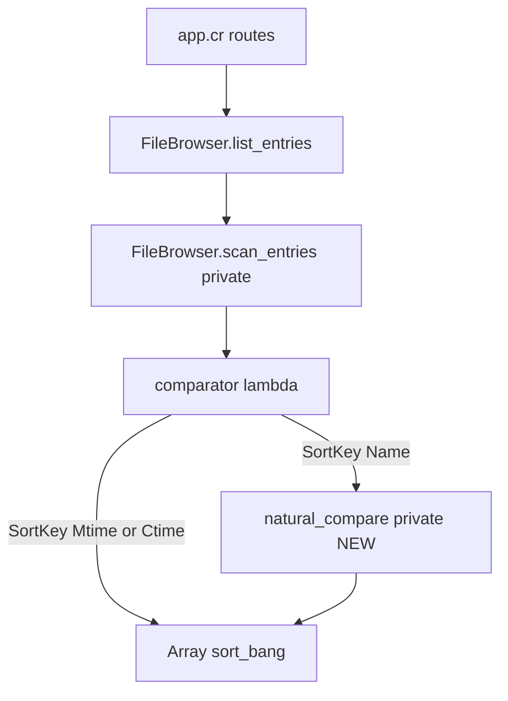
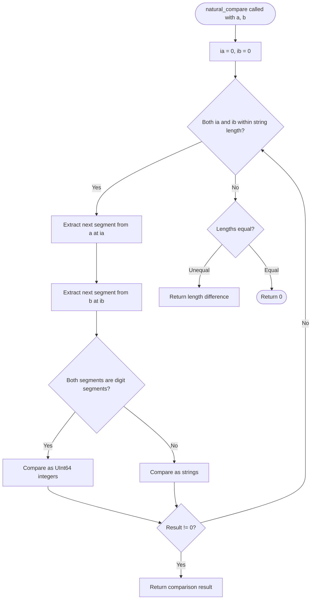

# Design Document: natural-sort

## Overview

**Purpose**: This feature replaces the lexicographic name comparator in `FileBrowser` with natural sort, so that numeric substrings within filenames are compared as integers rather than as character sequences. Users browsing directories with series of numbered files (e.g., `image1.png`…`image10.png`) see entries in the intuitive order `1 → 2 → … → 10` instead of `1 → 10 → 2`.

**Users**: All users of the media viewer who browse directories containing files or subdirectories with embedded numbers in their names.

**Impact**: A single private comparator expression in `FileBrowser.scan_entries` is replaced by a call to a new private helper `natural_compare`. No HTTP API surface, no configuration keys, and no frontend assets change.

### Goals

- Numeric segments within filenames are ordered by integer value when sort key is `Name`.
- Multi-segment filenames (e.g., `ep1part2.mp4`) are resolved correctly across all numeric positions.
- All existing sort keys (`Mtime`, `Ctime`), the directory-before-file grouping, and pagination remain unchanged.
- No new shard dependencies are introduced.

### Non-Goals

- Locale-aware collation (ICU/CLDR Unicode Collation Algorithm).
- Sorting behavior for non-`Name` sort keys.
- Changes to the HTTP query parameter surface (`sort`, `order`).
- Frontend or template modifications.

---

## Requirements Traceability

| Requirement | Summary | Component | Interface | Flow |
|-------------|---------|-----------|-----------|------|
| 1.1 | Split filename into digit/text segments; compare digits as integers | `natural_compare` | `natural_compare(a, b) : Int32` | Segment comparison loop |
| 1.2 | Smaller numeric value first (ascending) | `natural_compare` + comparator in `scan_entries` | Negative return value | — |
| 1.3 | Larger numeric value first (descending) | Comparator in `scan_entries` | Negation of `natural_compare` result | — |
| 1.4 | Pure-alphabetical names: unchanged case-insensitive ordering | `natural_compare` (single-segment path) | Falls through to string comparison | — |
| 2.1 | Multi-segment filenames compared segment-by-segment | `natural_compare` | Segment iteration loop | — |
| 2.2 | Shorter filename (prefix match) ordered first | `natural_compare` | Exhausted-segment fallback | — |
| 3.1 | Non-ASCII characters treated as non-digit text segments | `natural_compare` (digit check: ASCII only) | `Char#ascii_number?` | — |
| 3.2 | Text segments compared case-insensitively via pre-downcase | Comparator in `scan_entries` | Pre-downcase before `natural_compare` call | — |
| 3.3 | Multibyte character filenames: text in Unicode codepoint order, digits as integers | `natural_compare` (UTF-8 `each_char`) | Crystal `String#each_char` yields `Char` | — |
| 3.4 | Special ASCII punctuation in code-point order before lowercase letters | `natural_compare` (text segment string comparison) | `String#<=>` on downcased segments | — |
| 4.1 | Natural sort applies only to `SortKey::Name` | Comparator in `scan_entries` | `case sort_key` branch | — |
| 4.2 | Directory-before-file grouping preserved | `scan_entries` structure (unchanged) | `dirs + files` concatenation | — |
| 4.3 | Descending direction reverses natural order symmetrically | Comparator in `scan_entries` | `-cmp` negation (unchanged) | — |
| 4.4 | Pagination applied after sort | `list_entries` (unchanged) | `entries.skip(offset).first(limit)` | — |
| 5.1 | SSR initial batch uses natural sort | `GET /browse/` and `GET /browse/*path` via `list_entries` | Shared service call | — |
| 5.2 | JSON API batches use same natural sort | `GET /api/files/` and `GET /api/files/*path` via `list_entries` | Shared service call | — |
| 5.3 | Stable sort for equal filenames | `natural_compare` returns `0`; Crystal `Array#sort!` is stable | — | — |

---

## Architecture

### Existing Architecture Analysis

`FileBrowser` is a pure service module (`src/services/file_browser.cr`) with no HTTP concerns. The private method `scan_entries` builds the comparator lambda and applies it with `Array#sort!`. All four listing routes in `app.cr` delegate entirely to `FileBrowser.list_entries` — there is no duplicate sort logic in the routing layer.

The current `SortKey::Name` branch:
```
in SortKey::Name  then a.name.downcase <=> b.name.downcase
```
is the sole location to modify.

### Architecture Pattern & Boundary Map



- **Selected pattern**: In-place extension — new private helper within the existing module boundary.
- **Domain boundary**: `FileBrowser` module only; no new files, no new modules.
- **Existing patterns preserved**: `private def self.*` for internal helpers; `Array#sort!` with lambda comparator; pre-downcase before comparison.
- **New component rationale**: `natural_compare` is extracted as a named private method to keep the comparator lambda readable and to allow direct unit testing via `list_entries` boundary.
- **Steering compliance**: No new shard dependencies; module stays under `src/services/`; Crystal `snake_case` naming.

### Technology Stack

| Layer | Choice | Role in Feature | Notes |
|-------|--------|-----------------|-------|
| Services | Crystal stdlib (`String`, `Char`) | Segment parsing via `each_char`; digit detection via `Char#ascii_number?`; integer parsing via `String#to_u64?` | No new shards |

---

## System Flows



Key decision: when both strings are exhausted simultaneously, `0` is returned (stable sort preserves insertion order for equal names). When one is exhausted first, the shorter string is ordered first (requirement 2.2).

---

## Components and Interfaces

### Summary

| Component | Layer | Intent | Req Coverage | Key Dependencies | Contracts |
|-----------|-------|--------|--------------|-----------------|-----------|
| `natural_compare` | Service (new private method) | Compare two pre-downcased filenames using natural sort | 1.1, 1.2, 1.3, 1.4, 2.1, 2.2, 3.1, 3.3, 3.4 | Crystal `String`, `Char` stdlib | Service |
| `scan_entries` comparator | Service (1-line modification) | Route sort key to appropriate comparison function | 1.2, 1.3, 3.2, 4.1, 4.3 | `natural_compare` | — |

---

### Service Layer: `FileBrowser`

#### `natural_compare` (new private method)

| Field | Detail |
|-------|--------|
| Intent | Compare two pre-downcased filename strings using natural sort: digit runs as integers, non-digit runs as strings |
| Requirements | 1.1, 1.2, 1.3, 1.4, 2.1, 2.2, 3.1, 3.3, 3.4 |

**Responsibilities & Constraints**

- Accepts pre-downcased strings; applies no further case transformation.
- Digit segments: contiguous runs of ASCII characters `'0'`–`'9'` only (`Char#ascii_number?`). Non-ASCII codepoints (including multibyte characters) are never classified as digits.
- Digit segments are parsed as `UInt64`; overflow falls back to `0u64` (filenames with >20-digit runs are pathological and not a supported use case).
- Leading zeros in digit segments are normalized to their integer value (`"01"` == `"1"` == `1u64`).
- Pure function — no side effects, no I/O.

**Dependencies**

- External: Crystal stdlib `String`, `Char` — UTF-8 iteration and numeric parsing (P0).

**Contracts**: Service [x]

##### Service Interface

```crystal
# Within module FileBrowser
private def self.natural_compare(a : String, b : String) : Int32
```

- **Preconditions**: `a` and `b` are valid UTF-8 strings (Crystal `String` invariant). Callers are responsible for pre-downcasing.
- **Postconditions**: Returns a negative `Int32` if `a` sorts before `b`, `0` if equal, positive if `a` sorts after `b`. The return value is suitable for use as a comparator in `Array#sort!`.
- **Invariants**: The result is consistent and transitive (forms a total order over all `String` values).

**Implementation Notes**

- Integration: Replace the single expression `a.name.downcase <=> b.name.downcase` in the `SortKey::Name` branch with `natural_compare(a.name.downcase, b.name.downcase)`.
- Validation: No input validation needed; Crystal strings are always valid UTF-8 by construction.
- Risks: None identified. Existing tests for pure-alphabetical filenames continue to pass because natural sort degenerates to lexicographic sort when no digit segments are present.

---

#### `scan_entries` comparator (1-line modification)

| Field | Detail |
|-------|--------|
| Intent | Route the `SortKey::Name` branch to `natural_compare` instead of direct string comparison |
| Requirements | 1.2, 1.3, 3.2, 4.1, 4.3 |

**Responsibilities & Constraints**

- Only the `SortKey::Name` branch changes; `SortKey::Mtime` and `SortKey::Ctime` branches are untouched.
- The `sort_dir == SortDir::Desc ? -cmp : cmp` negation logic is untouched.
- Pre-downcase (`a.name.downcase`) is applied before passing to `natural_compare`, consistent with the existing pattern and satisfying requirement 3.2.

**Before / After**

| | Expression |
|--|--|
| Before | `in SortKey::Name then a.name.downcase <=> b.name.downcase` |
| After | `in SortKey::Name then natural_compare(a.name.downcase, b.name.downcase)` |

---

## Testing Strategy

### Unit Tests — `natural_compare` behavior (via `list_entries`)

New describe blocks in `spec/file_browser_sort_spec.cr` (or a dedicated `spec/file_browser_natural_sort_spec.cr`):

1. Core numeric ordering: `image1.jpg` < `image2.jpg` < `image10.jpg` (ascending).
2. Descending: `image10.jpg` > `image2.jpg` > `image1.jpg`.
3. Multi-segment: `ep1part2.mp4` < `ep1part10.mp4` < `ep2part1.mp4`.
4. Pure-alphabetical names: order unchanged vs. current behavior (`alpha.jpg`, `beta.jpg`, `gamma.jpg`).
5. Mixed text and numbers: `file1.jpg` < `file2.jpg` < `file10.jpg` < `file10a.jpg`.
6. Leading zeros: `file01.jpg` and `file1.jpg` compare equal numerically (either order is stable).
7. Multibyte prefix: `画像1.jpg` < `画像2.jpg` < `画像10.jpg`.
8. Special characters: `_file.jpg` < `afile.jpg` (underscore ASCII 95 < `a` ASCII 97).
9. Directory natural sort: `dir1/` < `dir2/` < `dir10/` (dirs-before-files grouping preserved).

### Regression Tests

All existing tests in `spec/file_browser_sort_spec.cr` must pass without modification. These cover:
- Pure-alphabetical Name/Asc and Name/Desc ordering.
- Mtime/Asc and Mtime/Desc ordering (unaffected).
- Ctime sort (unaffected).
- Directory-before-file invariant.
- Pagination slice correctness after sort.
- Backward-compatible default parameters.
