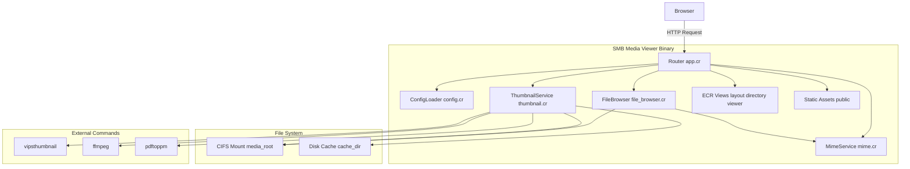
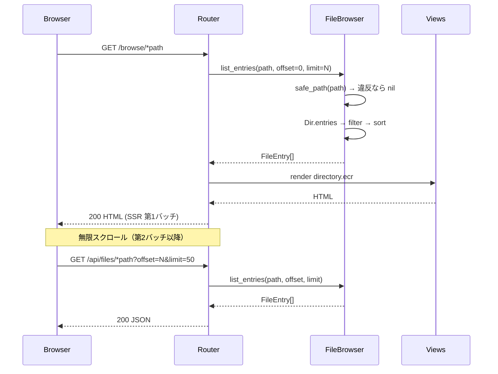
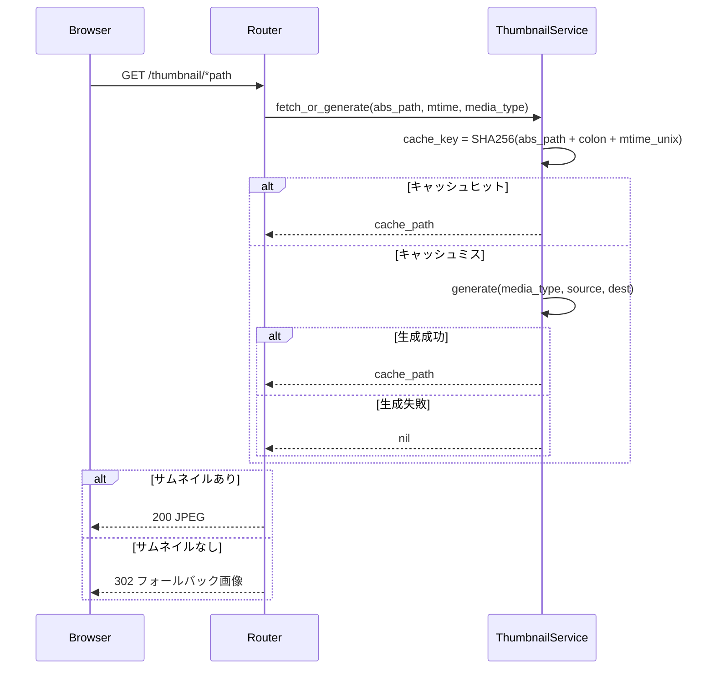
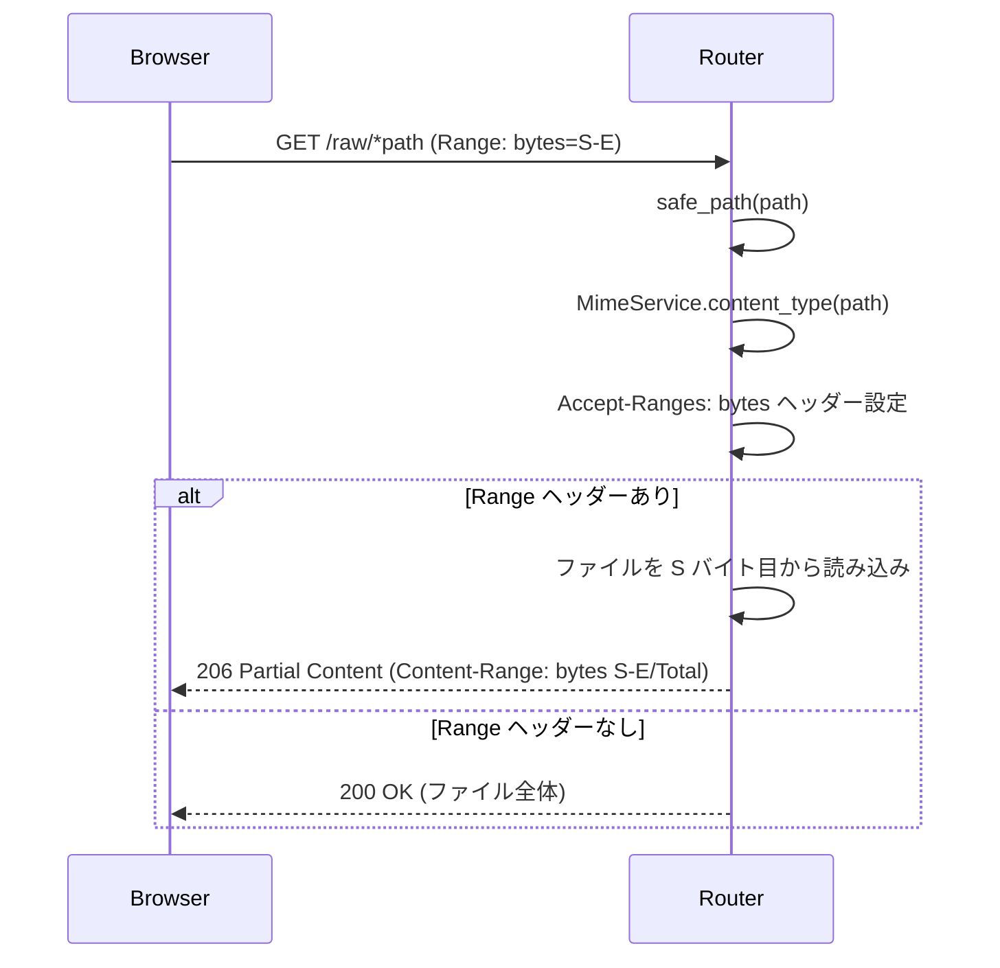

# 技術設計書: SMB Media Viewer

## 概要

本設計書は、CIFSマウントされたNASディレクトリのメディアファイル（画像・動画・PDF）をブラウザから閲覧する軽量Webサーバー「SMB Media Viewer」の技術アーキテクチャを定義する。

**目的**: ローカルネットワーク上のホームユーザー（古いスマートフォンを含む）が、NASに保存したメディアをブラウザから手軽に閲覧できる環境を提供する。

**ユーザー**: 自宅LAN内のデバイスを使うホームユーザー。追加のアプリやプラグインを必要としない。

**影響**: 新規開発（グリーンフィールド）。既存システムへの影響はない。

### 目標

- ミニPC上で常時稼働できる省リソースなシングルバイナリを提供する
- 古いブラウザでも動作するシンプルなフロントエンドを実現する
- サムネイル生成・ディスクキャッシュにより画像一覧の繰り返し表示を高速化する
- パストラバーサル攻撃を防止し、`media_root` 外へのアクセスを遮断する

### 非目標

- ユーザー認証・認可機能
- ファイルのアップロード・削除・編集
- クラウドストレージや外部APIとの連携
- SPAフレームワークの使用
- SMBクライアントライブラリによる直接接続（CIFSマウント済みを前提）

---

## 要件トレーサビリティ

| 要件 | 概要 | コンポーネント | インターフェース | フロー |
|------|------|----------------|------------------|--------|
| 1.1–1.6 | ディレクトリ閲覧・JSON API | Router, FileBrowser, Views | BrowseRoute, FilesApiRoute | ディレクトリ閲覧フロー |
| 2.1–2.6 | メディア表示・ファイル配信 | Router, Views, MimeService | ViewRoute, RawRoute | ビューアフロー |
| 3.1–3.3 | 動画 Range リクエスト | Router | RawRoute | 動画ストリーミングフロー |
| 4.1–4.7 | サムネイル生成・キャッシュ | ThumbnailService | ThumbnailRoute | サムネイルフロー |
| 5.1–5.5 | 遅延読み込み・無限スクロール | Frontend JS, Router | FilesApiRoute | — |
| 6.1–6.3 | パス安全性 | FileBrowser | `safe_path` | — |
| 7.1–7.3 | 設定読み込み | ConfigLoader | AppConfig | — |

---

## アーキテクチャ

### アーキテクチャパターンと境界マップ

採用パターン: **レイヤードアーキテクチャ**（Router → Services → Views）

- Router (`app.cr`) はHTTPのエントリポイントのみ担当し、ビジネスロジックを持たない（thin controller）
- Services (`src/services/`) はHTTP非依存の純粋なロジックを提供する
- Views (`src/views/`) はデータをHTMLに変換することのみを担当する
- 静的アセット (`public/`) はKemalが直接サーブする

ヘキサゴナルアーキテクチャも検討したが、この規模では過剰と判断した（詳細は `research.md` 参照）。



### テクノロジースタック

| レイヤー | 選択 / バージョン | 役割 | 備考 |
|----------|-----------------|------|------|
| 言語 | Crystal 1.15.1 | サーバーサイドロジック全般 | コンパイル済みバイナリ |
| Webフレームワーク | Kemal (latest) | HTTPルーティング・静的ファイル配信 | 唯一の shard 依存 |
| テンプレート | ECR（Crystal標準） | SSR HTML 生成 | 追加依存なし |
| フロントエンド | Vanilla JS + CSS | 遅延読み込み・無限スクロール | フレームワーク不使用 |
| 画像処理 | libvips (vipsthumbnail) | サムネイルリサイズ | ffmpeg より省メモリ |
| 動画処理 | ffmpeg | 動画フレーム抽出 | PATH 上に必要 |
| PDF処理 | poppler-utils (pdftoppm) | PDF 1ページ目の画像化 | PATH 上に必要 |
| 設定 | YAML（Crystal標準） | config.yml 読み込み | shard 追加不要 |
| 開発環境 | Docker + Docker Compose | Mac でのローカル開発 | test-media/ で CIFS をエミュレート |

---

## システムフロー

### ディレクトリ閲覧フロー（要件 1.1–1.6, 5.1–5.5）



### サムネイルフロー（要件 4.1–4.7）



### 動画ストリーミングフロー（要件 3.1–3.3）



---

## コンポーネントとインターフェース

### コンポーネント一覧

| コンポーネント | レイヤー | 責務 | 要件カバレッジ | 主要依存 (P0/P1) | コントラクト |
|----------------|----------|------|----------------|-----------------|-------------|
| Router (app.cr) | エントリポイント | HTTPルーティング・レスポンス組み立て | 1.1, 1.2, 1.6, 2.1, 2.6, 3.1–3.3, 4.1, 7.3 | FileBrowser (P0), ThumbnailService (P0) | API |
| ConfigLoader (config.cr) | 設定 | YAML 読み込み・デフォルト値提供 | 7.1–7.3 | — | State |
| MimeService (mime.cr) | サービス | 拡張子 → MediaType / Content-Type 変換 | 1.5, 2.2–2.4 | — | Service |
| FileBrowser (file_browser.cr) | サービス | ディレクトリ走査・パス検証・ページング・ソート | 1.2–1.6, 2.5, 6.1–6.2 | MimeService (P0), CIFS (P0) | Service |
| ThumbnailService (thumbnail.cr) | サービス | サムネイル生成・ディスクキャッシュ管理 | 4.1–4.7 | DiskCache (P0), ExtTools (P1) | Service |
| Views (ECR) | ビュー | SSR HTML 生成（layout / directory / viewer） | 1.2, 2.1–2.5, 5.1 | — | — |
| Frontend JS (app.js) | フロントエンド | 遅延読み込み・無限スクロール | 5.2–5.5 | FilesApiRoute (P0) | — |

---

### エントリポイント層

#### Router (app.cr)

| フィールド | 詳細 |
|---------|------|
| 責務 | Kemal ルート定義・リクエスト受付・レスポンス返却 |
| 要件 | 1.1, 1.2, 1.6, 2.1, 2.6, 3.1–3.3, 4.1, 7.3 |

**責務と制約**

- 7つのルートを定義し、各リクエストを適切なサービスに委譲する
- ビジネスロジックを持たない（thin controller）
- パス検証は FileBrowser.safe_path に委譲し、nil 返却時は即座に 400/404 を返す

**依存関係**

- Inbound: ブラウザ — HTTP リクエスト (P0)
- Outbound: FileBrowser — ディレクトリ一覧取得・パス検証 (P0)
- Outbound: ThumbnailService — サムネイル取得 (P0)
- Outbound: MimeService — Content-Type 解決 (P0)
- Outbound: Views (ECR) — HTML 描画 (P0)
- External: Kemal — HTTP フレームワーク (P0)

**コントラクト**: API [x]

##### API コントラクト

| メソッド | エンドポイント | リクエスト | レスポンス | エラー |
|---------|-------------|-----------|----------|-------|
| GET | / | — | 302 → /browse/ | — |
| GET | /browse/ | — | 200 HTML | 500 |
| GET | /browse/*path | path (URL) | 200 HTML | 400, 404, 500 |
| GET | /api/files/*path | offset, limit (クエリ) | 200 JSON FileEntry[] | 400, 404 |
| GET | /view/*path | path (URL) | 200 HTML | 400, 404 |
| GET | /raw/*path | Range ヘッダー（省略可） | 200 / 206 bytes | 400, 404 |
| GET | /thumbnail/*path | path (URL) | 200 JPEG / 302 フォールバック | 400 |

**実装メモ**

- `/raw/*` では動画判定後に `Accept-Ranges: bytes` ヘッダーを必ず付与する
- Range パースは `"bytes=S-E"` 形式を想定し、不正フォーマット時はファイル全体を返す
- サムネイル nil 時は `public/no-thumbnail.svg` にリダイレクトする

---

### サービス層

#### ConfigLoader (config.cr)

| フィールド | 詳細 |
|---------|------|
| 責務 | config.yml 読み込みとデフォルト値の提供 |
| 要件 | 7.1–7.3 |

**責務と制約**

- `YAML::Serializable` を使って `AppConfig` 構造体にデシリアライズする（`YAML.mapping` は使用しない）
- config.yml が存在しない場合はデフォルト値の `AppConfig` インスタンスを返す
- アプリ起動時に1回読み込み、グローバルな定数として保持する

**コントラクト**: State [x]

##### 状態モデル

```crystal
struct AppConfig
  include YAML::Serializable

  property media_root     : String = "/mnt/nas/media"
  property cache_dir      : String = "~/.cache/media-viewer"
  property port           : Int32  = 3000
  property thumbnail_size : Int32  = 200
  property items_per_page : Int32  = 50
end
```

- 不変条件: 実行中に設定変更は行わない（再起動が必要）

---

#### MimeService (mime.cr)

| フィールド | 詳細 |
|---------|------|
| 責務 | ファイル拡張子から MediaType と Content-Type を解決する |
| 要件 | 1.5, 2.2–2.4 |

**責務と制約**

- ファイル名（または拡張子）のみを入力とし、ファイル I/O を行わない
- 対応外拡張子は `MediaType::Unknown` を返す

**コントラクト**: Service [x]

##### サービスインターフェース

```crystal
enum MediaType
  Image   # jpg, jpeg, png, gif, webp, bmp, svg
  Video   # mp4, webm, mkv, avi, mov
  Pdf     # pdf
  Unknown
end

module MimeService
  def self.media_type(filename : String) : MediaType
  def self.content_type(filename : String) : String
  def self.supported?(filename : String) : Bool
end
```

- 事前条件: `filename` は空文字でないこと
- 事後条件: 常にいずれかの値を返す（nil なし）

---

#### FileBrowser (file_browser.cr)

| フィールド | 詳細 |
|---------|------|
| 責務 | ディレクトリ走査・パス安全性検証・ページング・ソート |
| 要件 | 1.2–1.6, 2.5, 6.1–6.2 |

**責務と制約**

- すべてのファイルアクセス前に `safe_path` でパス正規化・検証を行う
- ソート順: ディレクトリ優先 → 各グループ内はアルファベット順（大文字小文字無視）
- 隠しファイル（`.` 始まり）および非対応拡張子ファイルを除外する（ディレクトリは常に表示）
- `limit` は内部で最大100にクランプする

**依存関係**

- Outbound: MimeService — MediaType 判定 (P0)
- External: CIFS Mount (media_root) — ファイルシステムアクセス (P0)

**コントラクト**: Service [x]

##### サービスインターフェース

```crystal
struct FileEntry
  property name       : String
  property path       : String   # media_root からの相対パス
  property is_dir     : Bool
  property size       : Int64    # ディレクトリは 0
  property mtime      : Time
  property media_type : String   # "image" | "video" | "pdf" | "unknown"
end

module FileBrowser
  # 成功: FileEntry[]、パス違反: nil
  def self.list_entries(
    media_root : String,
    rel_path   : String,
    offset     : Int32,
    limit      : Int32
  ) : Array(FileEntry)?

  # media_root 内の絶対パスを返す。違反の場合 nil
  def self.safe_path(media_root : String, rel_path : String) : String?
end
```

- 事前条件: `offset >= 0`、`limit` は 1–100 の範囲内（超過分はクランプ）
- 事後条件: 返却配列内のすべての `path` は `media_root` 配下を指す
- 不変条件: `safe_path` が `nil` を返した場合、呼び出し元は必ず 400/404 を返す

**実装メモ**

- `Path.new(media_root, rel_path).normalize` でパス正規化後、`media_root` プレフィックスチェックを実施する
- CIFS 切断時に `Dir.entries` が例外を投げる可能性がある。Router 層で `rescue` して 500 を返す

---

#### ThumbnailService (thumbnail.cr)

| フィールド | 詳細 |
|---------|------|
| 責務 | サムネイル JPEG 生成とディスクキャッシュ管理 |
| 要件 | 4.1–4.7 |

**責務と制約**

- キャッシュキー: `Digest::SHA256.hexdigest("#{abs_path}:#{mtime.to_unix}")` + `.jpg`
- 生成失敗時は例外を伝播させず `nil` を返す
- 動画・PDF 処理の一時ファイルは生成後に必ず削除する

**依存関係**

- External: vipsthumbnail — 画像リサイズ (P1)
- External: ffmpeg — 動画フレーム抽出 (P1)
- External: pdftoppm — PDF 画像化 (P1)
- Outbound: DiskCache (cache_dir) — キャッシュ読み書き (P0)

**コントラクト**: Service [x]

##### サービスインターフェース

```crystal
module ThumbnailService
  # サムネイルキャッシュパスを返す。生成失敗時は nil
  def self.fetch_or_generate(
    abs_path   : String,
    mtime      : Time,
    media_type : MediaType,
    cache_dir  : String,
    size       : Int32
  ) : String?
end
```

##### 外部コマンド仕様

| メディア | コマンドフロー |
|---------|--------------|
| 画像 | `vipsthumbnail <src> --size NxN -o <dest>[Q=80]` |
| 動画 | `ffmpeg -ss 1 -i <src> -frames:v 1 <tmp.jpg>` → `vipsthumbnail <tmp> --size NxN -o <dest>[Q=80]` → tmp 削除 |
| PDF | `pdftoppm -jpeg -f 1 -l 1 <src> <tmp_prefix>` → glob で `<tmp_prefix>-*.jpg` を特定 → `vipsthumbnail` → tmp 削除 |

- 事前条件: `cache_dir` が存在・書き込み可能であること（起動時に `FileUtils.mkdir_p` で作成）
- 事後条件: 返却パスのファイルが読み取り可能であること
- 不変条件: 外部コマンド不在時はエラーログを出力し `nil` を返す（サーバーはクラッシュしない）

---

### ビュー層

#### ECR Views (layout.ecr / directory.ecr / viewer.ecr)

新たなドメイン境界を持たない SSR テンプレート群。

- `layout.ecr`: HTML シェル（head, nav, script/css 読み込み）を提供し、子テンプレートを埋め込む
- `directory.ecr`: `Array(FileEntry)` を受け取りサムネイルグリッド HTML を生成する。各 `` は `src=""`, `data-src="/thumbnail/..."` 形式で出力し、番兵 `<div id="sentinel">` を末尾に配置する
- `viewer.ecr`: `FileEntry`・前後エントリを受け取り、種別に応じた `` / `<video controls>` / `<object>` タグを出力する。PDF の `<object>` には `<a download>` フォールバックを含める

---

### フロントエンド層

#### Frontend JS (app.js)

新たなバウンダリを跨ぐ API コールを持つ UI ロジック（summary-only）。

- `IntersectionObserver` で `#sentinel` 要素を監視し、可視状態になったら `/api/files/*` を fetch して `<div class="grid">` に FileEntry カードを追記する（要件 5.2）
- サムネイル `` を `IntersectionObserver` で監視し、画面内で `src = data-src` をセット、画面外で `src = ""` にしてメモリを解放する（要件 5.3, 5.4）
- `typeof IntersectionObserver === 'undefined'` で分岐し、非対応ブラウザでは全 `` の `src` を即時セットする（要件 5.5）
- CSS / JS の合計サイズ目標: CSS ≤ 3 KB、JS ≤ 4 KB（外部依存なし）

---

## データモデル

### ドメインモデル

- **FileEntry**（値オブジェクト）: ディレクトリエントリを表す不変なデータ構造。FileBrowser が生成し、Router が Views に渡す
- **AppConfig**（設定集約）: アプリ全体の設定を保持する。起動時に1回生成され、全コンポーネントから参照される
- **MediaType**（列挙型）: `Image | Video | Pdf | Unknown` の4値。MimeService が解決し、FileBrowser と ThumbnailService が利用する

### 論理データモデル

**FileEntry 構造**

| フィールド | 型 | 説明 |
|---------|---|------|
| name | String | ファイル名 |
| path | String | media_root からの相対パス |
| is_dir | Bool | ディレクトリフラグ |
| size | Int64 | バイト数（ディレクトリは 0） |
| mtime | Time | 最終更新時刻 |
| media_type | String | "image" / "video" / "pdf" / "unknown" |

### データコントラクト

**`/api/files/*path` JSON レスポンス**

```json
[
  {
    "name": "photo.jpg",
    "path": "photos/photo.jpg",
    "is_dir": false,
    "size": 2048576,
    "mtime": "2025-01-01T00:00:00Z",
    "media_type": "image"
  }
]
```

- `mtime` は ISO 8601 UTC 形式
- ディレクトリの `size` は `0`

---

## エラーハンドリング

### エラー戦略

- **Fail Fast**: パス検証・パラメータ検証はリクエスト受付直後に実施する
- **Graceful Degradation**: サムネイル生成失敗はフォールバック画像で吸収し、サーバーをクラッシュさせない
- **ログ**: 外部コマンド失敗時はコマンドと終了コードを STDERR に出力する

### エラーカテゴリ別レスポンス

| カテゴリ | 条件 | レスポンス |
|---------|------|----------|
| パス違反 | `..` や media_root 外のパス | 400 Bad Request |
| 存在しないパス | ファイル / ディレクトリが見つからない | 404 Not Found |
| サムネイル生成失敗 | 外部コマンド失敗 | 302 → `public/no-thumbnail.svg` |
| CIFS 切断 | ファイルシステムアクセス例外 | 500 Internal Server Error |
| 不正パラメータ | limit > 100 | 100 にクランプ（エラーなし） |

---

## テスト戦略

### ユニットテスト

1. `MimeService.media_type` — 各拡張子（大文字小文字含む）が正しい `MediaType` を返すこと
2. `MimeService.supported?` — 非対応拡張子・隠しファイルが `false` を返すこと
3. `FileBrowser.safe_path` — `..` 入力・絶対パス・正常パスの各ケース
4. `FileBrowser.list_entries` — ソート順・フィルタ・ページング・limit クランプの正確性
5. `ThumbnailService` — キャッシュキー生成の一貫性（同一入力 → 同一キー）

### 統合テスト

1. `GET /browse/*path` — SSR レスポンスに FileEntry の HTML が含まれること
2. `GET /api/files/*path` — JSON レスポンスのスキーマ検証・offset/limit 適用確認
3. `GET /thumbnail/*path` — サムネイルが生成・キャッシュされ JPEG で返却されること
4. `GET /raw/*path` with Range ヘッダー — 206 レスポンスと正しいバイト範囲・`Content-Range` ヘッダー
5. パストラバーサル — `../../etc/passwd` 等が 400/404 を返すこと

### パフォーマンス

1. 100件エントリのディレクトリ一覧応答時間 < 100 ms（CIFS 正常時）
2. サムネイルキャッシュヒット時の応答時間 < 20 ms
3. 動画 Range リクエストのファーストバイト時間 < 50 ms

---

## セキュリティ考慮事項

- **パストラバーサル防止**: `FileBrowser.safe_path` をすべてのファイルサービングルートで必ず呼び出す。`nil` 返却時は即座に 400/404 を返す
- **外部コマンドインジェクション**: 外部コマンドへ渡すパスは `safe_path` 通過後のもののみ使用する。`Process.run` はシェル展開を経由しない形式で呼び出す
- **読み取り専用**: アプリはキャッシュディレクトリ以外のファイルシステムへの書き込みを行わない
- **認証なし**: ローカルネットワーク前提。ファイアウォールで LAN 外からのアクセスを制限することを推奨する

## パフォーマンスと省リソース

- **シングルバイナリ**: `crystal build --release` で生成し、常時稼働ランタイムを最小化する
- **カーネルキャッシュ**: CIFS マウントにより OS レベルのページキャッシュが有効になり繰り返しアクセスが高速化される
- **省メモリサムネイル**: vipsthumbnail は ImageMagick より低メモリでリサイズを実行する
- **メモリ解放**: フロントエンド JS は画面外 `` の `src` を空にしてブラウザの画像デコードキャッシュを解放する
- **systemd リソース制限**: 本番デプロイ時に `MemoryMax=256M`、`CPUQuota=50%` を設定する
