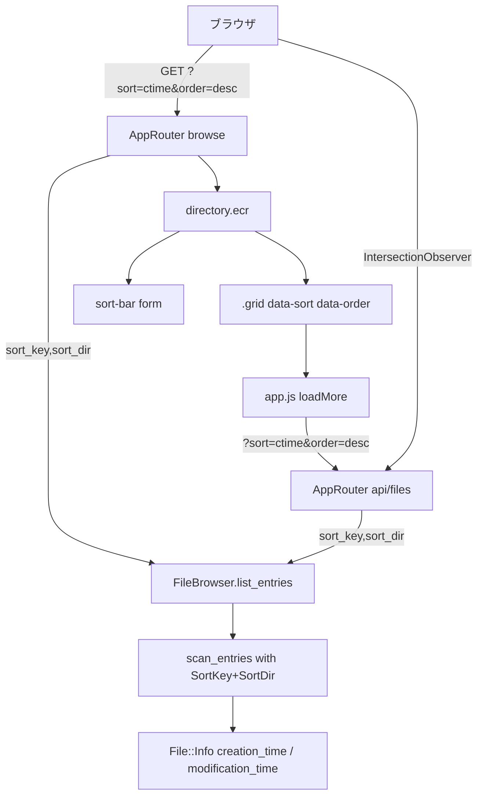
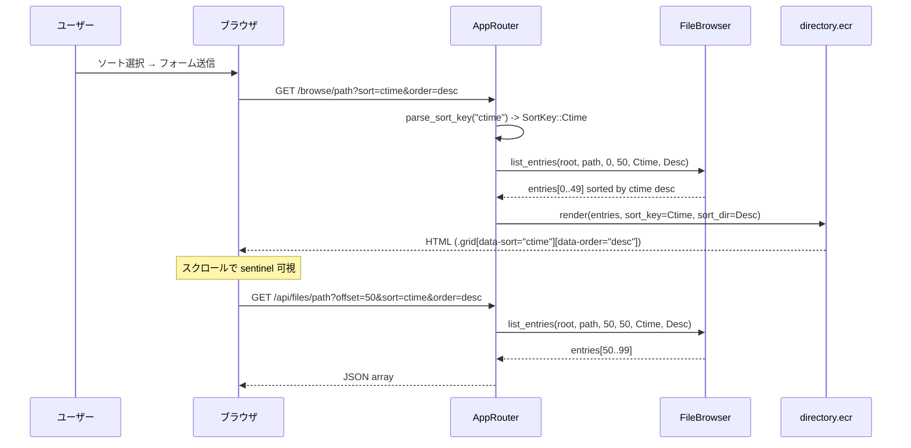

# Design Document: sorting-feature

## Overview

**Purpose**: ディレクトリ一覧ページにユーザー制御可能なソート機能を追加し、ファイル名・作成日時・更新日時の3キーと昇順/降順を選択できるようにする。

**Users**: ホームネットワークのユーザーが、サムネイルグリッド上のソート順を変更することで目的のファイルをすばやく見つけられるようになる。

**Impact**: 既存の固定ソート（ディレクトリ優先・名前アルファベット順）を、パラメータ化されたソートロジックで置き換える。`FileEntry` 構造体、`FileBrowser.list_entries` のシグネチャ、HTTP ルートハンドラ、`directory.ecr` テンプレート、`app.js` のすべてに段階的な変更を加える。

### Goals

- ソートキー (`name` / `ctime` / `mtime`) と方向 (`asc` / `desc`) をクエリパラメータで制御できるようにする
- SSR 初回バッチと JSON API の追加バッチで一貫したソート順を維持する
- JS 不使用の HTML フォームでソートを切り替えられる（古いブラウザ対応）
- ディレクトリ優先の表示順を維持する

### Non-Goals

- クライアントサイドソート（JS によるリストの再並べ替え）
- ファイルサイズによるソート
- セッションや LocalStorage へのソート設定の永続化（URL クエリパラメータのみ）
- ソートキーを `/view/*` のナビゲーション順序に適用する（デフォルト Name/Asc を維持）

---

## Architecture

### Existing Architecture Analysis

現在のアーキテクチャ:

- `FileBrowser.scan_entries` は `name.downcase` のアルファベット順でソートをハードコードしている
- `list_entries` は `(media_root, rel_path, offset, limit)` の4引数を受け取る
- `directory.ecr` はソートパラメータを保持せず、`.grid` に `data-path` と `data-offset` のみを持つ
- `app.js` の `loadMore` は `offset` と `limit` のみを API に渡す

変更は既存の責務レイヤーを維持したまま各層に最小限の拡張を加える形で実施する。

### Architecture Pattern & Boundary Map



**Architecture Integration**:
- 選択パターン: パラメータ化サービス拡張（Parameterized Service Extension）
- ルート層がクエリ文字列をパースして enum に変換し、サービス層は HTTP を知らない（steering 原則遵守）
- 既存パターン維持: `safe_path` による境界チェック、`before_each` / `after_each` テストパターン、ページング方式
- 新コンポーネントなし。`SortKey` / `SortDir` enum は `file_browser.cr` 内に追加する

### Technology Stack

| Layer | Choice / Version | Role in Feature |
|-------|-----------------|-----------------|
| Backend / Service | Crystal 1.15.1 / `File::Info` | `creation_time` と `modification_time` でソート値を取得 |
| HTTP Layer | Kemal 1.9.0 | `sort` / `order` クエリパラメータを parse して enum に変換 |
| Template | ECR (Crystal 標準) | ソートコントロール form をレンダリング; active 状態を `selected` で表示 |
| Frontend | Vanilla JS (app.js 既存) | `grid.dataset.sort/order` を読み取り API fetch URL に付与 |
| CSS | style.css (既存, ≤3KB) | `.sort-bar` スタイルを最小限追加 |

---

## System Flows



シーケンスのキー決定: sort/order パラメータは SSR ルートと JSON API ルートで同一のパース処理を経由することで、ソート一貫性を保証する。

---

## Requirements Traceability

| Requirement | Summary | Components | Contracts |
|-------------|---------|------------|-----------|
| 1.1 | 3ソートキー対応 | `SortKey` enum, `scan_entries` | `list_entries` シグネチャ |
| 1.2 | 無効値でデフォルト | `parse_sort_key` | デフォルト `SortKey::Name` |
| 1.3 | SSR と API で同一ソート | `AppRouter` browse/api 両ルート | `list_entries` 共通呼び出し |
| 2.1 | 2方向対応 | `SortDir` enum | `list_entries` シグネチャ |
| 2.2 | 無効値でデフォルト | `parse_sort_dir` | デフォルト `SortDir::Asc` |
| 2.3 | ctime desc = 最新作成順 | `scan_entries` sort comparator | — |
| 2.4 | mtime desc = 最新更新順 | `scan_entries` sort comparator | — |
| 2.5 | name asc = A→Z | `scan_entries` sort comparator | — |
| 3.1–3.3 | ディレクトリ優先 | `scan_entries` group separation | — |
| 4.1 | browse ルートでクエリパラメータ受付 | `AppRouter` browse | GET /browse/*path?sort&order |
| 4.2 | api ルートでクエリパラメータ受付 | `AppRouter` api | GET /api/files/*path?sort&order |
| 4.3 | 無効値サイレントフォールバック | `parse_sort_key`, `parse_sort_dir` | — |
| 4.4 | HTML に active sort 値を埋め込む | `directory.ecr` | `data-sort`, `data-order` 属性 |
| 5.1–5.3 | ソートコントロール + active 表示 | `directory.ecr` sort-bar | HTML form |
| 5.4 | JS 不要・旧ブラウザ対応 | `directory.ecr` | `<form method="get">` のみ |
| 5.5 | 既存レイアウト内に統合 | `directory.ecr` | `.navbar` 直下または grid 上部 |
| 6.1–6.3 | ページング整合性 | `AppRouter` api, `app.js` | offset は sort 済みリストに対して適用 |

---

## Components and Interfaces

### コンポーネント一覧

| Component | Layer | Intent | Req Coverage | Key Dependencies |
|-----------|-------|--------|--------------|-----------------|
| `SortKey` enum | Service | ソートキーの型安全な表現 | 1.1, 1.2 | なし |
| `SortDir` enum | Service | ソート方向の型安全な表現 | 2.1, 2.2 | なし |
| `FileBrowser.list_entries` | Service | ソートパラメータを受け付けるよう拡張 | 1.1–1.3, 2.x, 3.x, 6.x | `SortKey`, `SortDir` |
| `AppRouter` browse/api routes | HTTP | クエリパラメータの parse と転送 | 4.1–4.4, 6.1 | `FileBrowser`, `SortKey`, `SortDir` |
| `directory.ecr` sort-bar | View | ソートコントロール UI + active 状態 | 5.x, 4.4 | `sort_key`, `sort_dir` locals |
| `app.js` loadMore | Frontend | API fetch に sort/order を付与 | 6.1 | `grid.dataset.sort/order` |

---

### Service Layer

#### SortKey / SortDir enum と FileBrowser 拡張

| Field | Detail |
|-------|--------|
| Intent | ソートキーと方向を型安全に定義し、`list_entries` を拡張してパラメータ化されたソートを提供する |
| Requirements | 1.1, 1.2, 1.3, 2.1, 2.2, 2.3, 2.4, 2.5, 3.1, 3.2, 3.3, 6.1, 6.2, 6.3 |

**Responsibilities & Constraints**
- `SortKey` と `SortDir` は `file_browser.cr` 内に定義する（HTTP 層への露出なし）
- `parse_sort_key` / `parse_sort_dir` はルート層が呼び出す。無効値は例外を発生させずデフォルト値を返す
- `scan_entries` はソートを担い、ディレクトリグループとファイルグループを分離した上で各グループ内に sort key / dir を適用する
- `ctime` フィールドはソート専用。JSON シリアライズから除外する

**Dependencies**
- Inbound: `AppRouter` — `list_entries(sort_key, sort_dir)` を呼び出す (P0)
- Outbound: `File::Info` — `creation_time`, `modification_time` を参照 (P0)

**Contracts**: Service [x]

##### Service Interface

```crystal
enum SortKey
  Name   # ファイル名（大文字小文字無視）デフォルト
  Ctime  # 作成日時
  Mtime  # 最終更新日時
end

enum SortDir
  Asc    # 昇順（A→Z, 古→新）デフォルト
  Desc   # 降順（Z→A, 新→古）
end

module FileBrowser
  # sort_key / sort_dir はデフォルト値付き → 既存呼び出し元の変更不要
  def self.list_entries(
    media_root : String,
    rel_path   : String,
    offset     : Int32,
    limit      : Int32,
    sort_key   : SortKey = SortKey::Name,
    sort_dir   : SortDir = SortDir::Asc
  ) : Array(FileEntry)?

  # 無効な文字列はデフォルト値を返す（例外なし）
  def self.parse_sort_key(s : String) : SortKey
  def self.parse_sort_dir(s : String) : SortDir
end

struct FileEntry
  # ... 既存フィールド ...
  @[JSON::Field(ignore: true)]
  property ctime : Time   # ソート専用。JSON API には含まれない
end
```

- Preconditions: `rel_path` は `safe_path` 検証済み; `offset >= 0`; `limit` は内部でクランプ
- Postconditions: 返却配列はディレクトリ優先・sort_key/sort_dir に従って整列されている
- Invariants: ディレクトリグループとファイルグループは常に分離される

**Implementation Notes**
- `scan_entries` 内のソート comparator を `sort_key` と `sort_dir` に応じて分岐させる。方向 `Desc` の場合は comparator の `a <=> b` を `b <=> a` に反転する
- `File::Info#creation_time` が利用できないシステムでは `mtime` と同値になる可能性があるが、これはソート誤動作ではない
- Risk: CSS サイズ制限（3KB）。sort-bar のスタイルは最小限にとどめ、追加量は 200B 以内を目標とする

---

### HTTP Layer

#### AppRouter — browse / api route 拡張

| Field | Detail |
|-------|--------|
| Intent | `sort` / `order` クエリパラメータを parse して `FileBrowser.list_entries` に渡す |
| Requirements | 4.1, 4.2, 4.3, 4.4, 1.3, 6.1 |

**Contracts**: API [x]

##### API Contract

| Method | Endpoint | Query Params | Response | Errors |
|--------|----------|-------------|----------|--------|
| GET | /browse/ | sort, order | SSR HTML | 400 (path violation) |
| GET | /browse/*path | sort, order | SSR HTML | 400, 404 |
| GET | /api/files/ | offset, limit, sort, order | JSON Array(FileEntry) | 400 |
| GET | /api/files/*path | offset, limit, sort, order | JSON Array(FileEntry) | 400, 404 |

- `sort`: `"name"` \| `"ctime"` \| `"mtime"` — 不正値は `"name"` にフォールバック
- `order`: `"asc"` \| `"desc"` — 不正値は `"asc"` にフォールバック
- 既存パラメータ (`offset`, `limit`) は変更なし

**Implementation Notes**
- `sort_key = FileBrowser.parse_sort_key(env.params.query["sort"]? || "name")`
- `sort_dir = FileBrowser.parse_sort_dir(env.params.query["order"]? || "asc")`
- browse ルートは `sort_key` と `sort_dir` を ECR テンプレートのローカル変数として渡す

---

### View Layer

#### directory.ecr — ソートコントロール追加

| Field | Detail |
|-------|--------|
| Intent | sort-bar フォームで現在のソート状態を表示し、ユーザーがソートを変更できるようにする |
| Requirements | 5.1, 5.2, 5.3, 5.4, 5.5, 4.4 |

**Contracts**: (presentational — summary only)

- `.grid` div に `data-sort="<%= sort_key.to_s.downcase %>"` と `data-order="<%= sort_dir.to_s.downcase %>"` 属性を追加する
- `<form class="sort-bar" method="get">` を grid 直上に配置する
  - `<select name="sort">` に `name` / `ctime` / `mtime` オプション。現在の `sort_key` に `selected` を付与
  - `<select name="order">` に `asc` / `desc` オプション。現在の `sort_dir` に `selected` を付与
  - `<button type="submit">` でフォーム送信（ページ全体リロード）
- ECR ローカル変数: `sort_key : SortKey`, `sort_dir : SortDir`（ルート層から渡される）

---

### Frontend Layer

#### app.js — loadMore の sort/order 付与

| Field | Detail |
|-------|--------|
| Intent | 無限スクロールの API fetch に sort/order クエリパラメータを追加し、SSR と同一ソートを維持する |
| Requirements | 6.1, 4.2 |

**Contracts**: (presentational — summary only)

- `grid.dataset.sort`（デフォルト `'name'`）と `grid.dataset.order`（デフォルト `'asc'`）を読み取る
- fetch URL を `'/api/files/' + path + '?offset=' + offset + '&limit=50&sort=' + sort + '&order=' + order` に変更する
- 既存の `IntersectionObserver` ロジック・フォールバックには変更なし
- JS ファイルサイズへの影響: +約 60B（4KB 制限に余裕あり）

---

## Data Models

### Domain Model

`FileEntry` 値オブジェクトに `ctime : Time` フィールドを追加する。

- `ctime` はソート用の内部値であり、JSON API には公開しない（`@[JSON::Field(ignore: true)]`）
- 既存の `mtime : Time` は変更なし
- `FileEntry` の不変条件: `ctime` および `mtime` は `File::Info` から読み取った時刻であり、書き込みは行わない

### Data Contracts & Integration

**API レスポンス変化なし**: `@[JSON::Field(ignore: true)]` により、`ctime` は JSON レスポンスに含まれない。既存のクライアントコードは変更不要。

**ソートパラメータ**: `sort` と `order` はクエリ文字列のみで管理する。データベースやキャッシュへの永続化はしない。

---

## Error Handling

### Error Strategy

- **Invalid sort/order values**: `parse_sort_key` / `parse_sort_dir` がデフォルト値を返す。HTTP エラーは返さない（要件 4.3）
- **File::Info 取得失敗**: 既存の例外処理（CIFS 切断時 500）を変更しない
- **sort 値のインジェクション**: `parse_sort_key` が enum マッチで無効値を棄却するため、文字列がサービス層以降に伝播することはない

### Monitoring

既存の STDERR エラーログを維持する。ソート機能自体のエラーは発生しないが、ファイルシステムアクセス失敗は既存の 500 ハンドラで捕捉される。

---

## Testing Strategy

### Unit Tests (FileBrowser service)

- `parse_sort_key`: 有効値3種・無効値・nil/absent 各ケース
- `parse_sort_dir`: 有効値2種・無効値各ケース
- `list_entries` with `sort_key=Ctime, sort_dir=Desc`: 最も新しい ctime のファイルが先頭になることを検証
- `list_entries` with `sort_key=Mtime, sort_dir=Asc`: 最も古い mtime のファイルが先頭になることを検証
- ディレクトリ優先が全ソートキーで維持されることを検証（既存テストを sort パラメータ付きで拡張）

### Integration Tests (HTTP routes)

- `GET /browse/?sort=mtime&order=desc` → SSR HTML にソート順が反映されているか
- `GET /api/files/?sort=ctime&order=asc` → JSON レスポンスの順序が正しいか
- `GET /api/files/?sort=invalid&order=bad` → デフォルト Name/Asc で 200 を返すか
- `GET /api/files/?offset=50&sort=mtime&order=desc` → 2 バッチ目が同一ソートを維持するか

### Static Asset Tests

- `app.js` が `data-sort` / `data-order` 属性を参照するコードを含むことを検証（文字列一致テスト）
- CSS が `.sort-bar` セレクターを含み、3KB 制限内であることを検証
